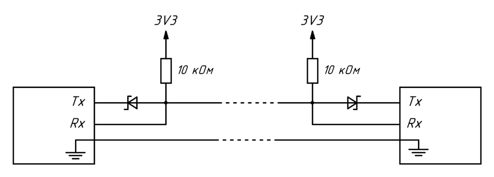
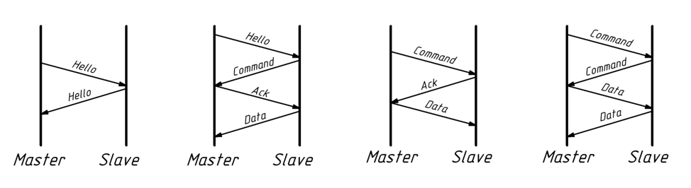

# Half-duplex-uart

Модуль для организации полудуплексного UART-соединения на микроконтроллере CH592F.

Среда разработки: MounRiver Studio.

Микроконтроллер CH592F имеет четыре независимых UART-модуля. Задачей проекта было организовать мониторинг состояния линии каждым из четырёх UART и определение наличия или отсутствия соединения с соседним устройством.

Одной из целей проекта было уменьшить количество проводов в соединении с четырёх (`VCC`, `TX`, `RX`, `GND`) до трёх (`VCC`, `DATA`, `GND`), что позволяет уменьшить габариты разъёма.

Для этого один провод `DATA` используется для передачи данных в обоих направлениях поочерёдно, то есть соединение работает в полудуплексном режиме.

Для предотвращения короткого замыкания при одновременной попытке передачи данных порты подключаются через защитные диоды.

Поскольку данные по линии могут передаваться только в одном направлении в каждый момент времени, необходимо исключить одновременную передачу со стороны обоих устройств. Для этого каждому порту назначается роль `Master` или `Slave`, а обмен данными происходит по протоколу рукопожатия. Инициатором обмена всегда выступает `Master`.

Через определённые интервалы времени устройства обмениваются короткими `Hello`-пакетами. Если ответ на пакет не поступает в течение заданного цикла, соединение считается разорванным.

## Использование

Основной код модуля находится в `User/Modules/UART_Port.cpp`.

Пример использования находится в `User/Main.cpp`.

Для корректной работы проекта необходимо переключить основной язык проекта с C на C++.
